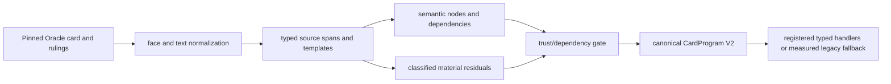

# Oracle compiler

The typed Oracle compiler transforms a pinned local Scryfall record into Oracle
IR, recognized semantic nodes, dependency declarations, and material residuals.
It is deterministic for the same card/rulings snapshot and compiler version.
`oracle_ir.py` owns parsing and IR compatibility; the extracted
`compiler/program_generation.py` stage owns lowering exact nodes into registry
programs and preserves the public compatibility functions.
`card_programs/adapters.py` combines those abilities, face identities,
residuals, source hashes, and capability closure into canonical CardProgram V2.

## Invariants

- Every lowered node retains source provenance.
- Unknown grammar becomes an explicit residual rather than guessed behavior.
- Exact parsing is not equivalent to complete runtime behavior.
- A program cannot be trusted beyond the closure of its mechanics, targets,
  costs, zones, events, replacements, and runtime operations.
- Reviewed node shapes use versioned fine-grained capability closure. Unmapped
  shapes continue through the legacy broad mechanic gate and do not inherit
  trust from a migrated neighbor.
- The local card database is a compiler input, not an engine dependency during
  a transition.
- Reviewed semantic-pack abilities and generated abilities enter the same
  CardProgram schema. A same-key reviewed ability wins; conflicting source or
  face identity fails closed.

## Extension points

Add reusable grammar and typed nodes before considering a card override. Every
new stage or CardProgram schema version requires an ADR. Update source-pinned
positive, negative, and residual tests and regenerate the authoritative JSON
and [compiler coverage report](../COMPILER_COVERAGE_STATUS.md).

Corpus-wide completeness remains unclaimed until the generated gates say
otherwise.
