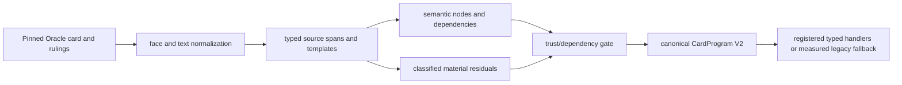

# Oracle compiler

The typed Oracle compiler transforms a pinned local Scryfall record into Oracle
IR, recognized semantic nodes, dependency declarations, and material residuals.
It is deterministic for the same card/rulings snapshot and compiler version.
`oracle_ir.py` owns parsing and IR compatibility; the extracted
`compiler/program_generation.py` stage owns lowering exact nodes into registry
programs and preserves the public compatibility functions.
`card_programs/adapters.py` combines those abilities, face identities,
residuals, source hashes, and capability closure into canonical CardProgram V2.

## Invariants

- Every lowered node retains source provenance.
- Unknown grammar becomes an explicit residual rather than guessed behavior.
- Exact parsing is not equivalent to complete runtime behavior.
- A program cannot be trusted beyond the closure of its mechanics, targets,
  costs, zones, events, replacements, and runtime operations.
- Reviewed node shapes use versioned fine-grained capability closure. Unmapped
  shapes continue through the legacy broad mechanic gate and do not inherit
  trust from a migrated neighbor.
- The local card database is a compiler input, not an engine dependency during
  a transition.
- Reviewed semantic-pack abilities and generated abilities enter the same
  CardProgram schema. A same-key reviewed ability wins; conflicting source or
  face identity fails closed.
- Multi-sentence resolution templates preserve written instruction order.
  Choice-bearing instructions retain later siblings in their replayable
  continuation. A later sentence becomes prevention aftermath only when its
  supported grammar explicitly depends on damage `prevented this way`; mere
  adjacency never implies that dependency.
- Oracle IR v18 changed the fixed chosen-source/prevention/life production to
  template v2. Independent draw or conditional aftermath wording that is not
  yet supported remains a material residual rather than being misclassified.
- Oracle IR v19 adds the closed generic source-controller damage-aftermath
  production. Only explicit prevention-dependent wording lowers into the typed
  CR 615.5 result; CR 615.13 `When damage is prevented this way` wording remains
  residual until its triggered stack object is represented.
- Oracle IR v20 replaces parallel chosen-source qualifier fields with a strict
  canonical `ObjectQuerySpec`. The compiler, seat-scoped source choice, durable
  source snapshot, and damage-time characteristic recheck therefore share one
  serialized predicate meaning while retaining source-specific CR 609.7
  identity and provenance rules.
- Oracle IR v21 lowers the closed CR 615.13 prevention-trigger result families
  into ordinary stack triggers and keeps broader conditional forms residual.
- Oracle IR v22 separates normalized zone-event detection, APNAP placement, and
  result-operation closure for represented self enter/dies/leaves triggers.
- Oracle IR v23 lowers closed fixed-query static power/toughness effects and
  controlled-creature until-end-of-turn modifiers. Its templates are anchored
  to complete represented text and reject stateful, combat-only, conditional,
  or unresolved-target lookalikes.
- Oracle IR v24 adds exact-relation attached fixed-characteristic components
  and fixed ordinary-mana Equip lowering through the reciprocal attachment
  owner.
- Oracle IR v25 lowers only the closed simple battlefield-object Enchant
  keyword grammar to a mandatory target schema and the trusted Aura capability.
  Qualities, subtypes, players, cards in other zones, multiple restrictions,
  and Aura creatures remain material residuals.
- Oracle IR v27 lowers closed fixed mandatory and optional draw instructions for the controller,
  target player, target opponent, and each player, plus keyword-derived
  `Dredge N`, fixed no-draw/maximum-one restrictions, and unconditional
  controller doubling. Those programs require the trusted bounded draw
  capability and runtime components; dynamic counts, conditional limits, and
  unrelated residual text still prevent exact promotion.
- Oracle IR v28 closes fixed controlled-creature modifiers over a pinned CR
  205.3m creature-subtype vocabulary. Capitalization is never subtype
  evidence. Color, legendary, artifact, and validated creature-subtype
  predicates lower; token, nontoken, snow, commander, combat-state, negative,
  and unsupported compound qualities remain exact source-spanned residuals.
  Runtime-handler deduplication consumes the entire canonical typed query and
  modifier, so a reviewed handler cannot shadow a generated handler with
  different semantics.
- Oracle IR v29 lowers the represented Enchant and protection keyword grammar
  into immutable runtime fragments. Runtime casting, Aura entry/legality,
  targeting, blocking, attachment, and damage consume those fragments without
  reparsing Oracle text. Unsupported protection qualities and Enchant
  restrictions remain precise material residuals.

## Extension points

Add reusable grammar and typed nodes before considering a card override. Every
new stage or CardProgram schema version requires an ADR. Update source-pinned
positive, negative, and residual tests and regenerate the authoritative JSON
and [compiler coverage report](../COMPILER_COVERAGE_STATUS.md).

Corpus-wide completeness remains unclaimed until the generated gates say
otherwise.

See [ADR 0020](../adr/0020-continuous-effect-duration-and-applicability.md)
for the runtime duration/applicability boundary consumed by Oracle IR v23.
