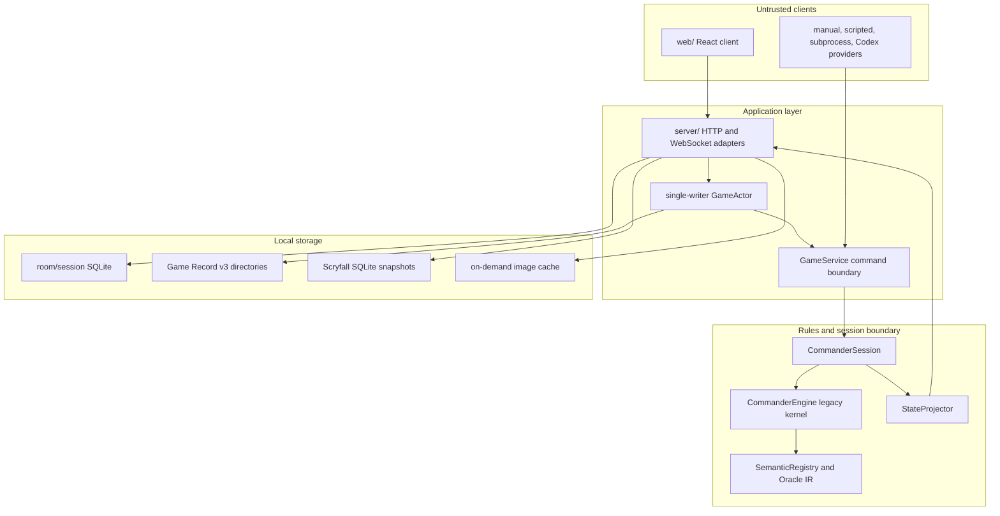

# Runtime containers

## Ownership

- `CommanderEngine` is the legacy authoritative mutation boundary during the
  migration. New mutation owners are prohibited by policy.
- `CommanderSession` manages capabilities, projected decisions, yields, and the
  ordered command protocol around the engine.
- `GameService` validates command envelopes, idempotency, authorization, and
  persistence before acknowledgement.
- `server/` owns guest/room lifecycle, one actor mailbox per game, HTTP and
  WebSocket transport, managed data, and browser assets.
- `StateProjector` is read-only and emits principal-scoped views.

The dependency policy is executable in `scripts/validate_architecture.py`.
Measured migration debt and allowed legacy exceptions live in generated and
machine-readable architecture artifacts, not in this document.
