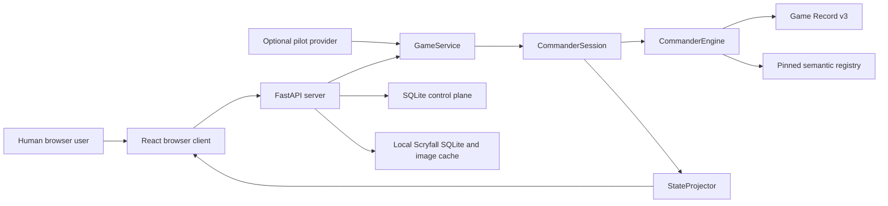

# System context

The application is a deterministic, server-authoritative Commander platform.
Humans, scripted pilots, subprocess pilots, and optional Codex pilots all use
the same projected legal-action protocol. They do not mutate game state or
interpret Oracle text as authority.

The server is currently a single-process local-development deployment. One
serialized actor owns each loaded game. The game record, card-data fingerprint,
semantic fingerprint, commands, and checkpoints make replay fail closed when
the required environment differs.

## External systems

- Scryfall supplies bulk Oracle/rulings data and card images to the managed
  local cache. Network access does not occur inside a game transition.
- Moxfield is an optional deck-source adapter. Imported lists are validated
  against the pinned local card snapshot before game creation.
- GitHub Actions is the public merge gate. Local exact-head validation is an
  additional release discipline, not a runtime dependency.
- AI providers are optional clients. Core gameplay, rules enforcement, replay,
  server startup, and tests do not require them.

## Current versus target

Current behavior is the implemented partial Commander kernel and local
browser/server runtime described above. The target is a modular compiler-backed
rules platform with complete capability closure for a pinned rules and Oracle
snapshot. Target work must not be described as implemented until its generated
coverage and executable evidence pass.
