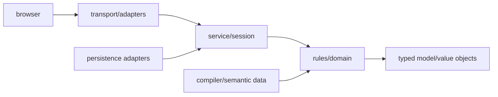

# Dependency and mutation rules

The executable policy in `platform/architecture-policy.json` is authoritative.
This document explains its intent.

Dependencies point toward the domain. Protected rules/domain modules may not
import server frameworks, WebSockets, persistence adapters, AI providers, or
application/session orchestration. Compiler and metadata code may describe
rules programs but may not acquire runtime mutation authority.

`mtg_commander_sim/card_programs/` owns the deterministic CardProgram V2 model,
generated/reviewed adapters, source/trust validation, and inspection commands.
It may depend on compiler output, semantic value objects, the card database,
and capability metadata. It must not depend on transport, server, pilot,
session, or persistence orchestration, and it never mutates `GameState`.

`CommanderEngine` remains a measured legacy mutation boundary while it is
decomposed. New engine methods, direct `GameState` write sites, card-name/Oracle
ID branches, card-specific operations/helpers, oversized modules/functions, or
unreviewed dependency exceptions fail the architecture gate. Existing debt is
ratcheted rather than endorsed.

Any new subsystem documents ownership and dependencies. Changing mutation
ownership or adding a cross-layer dependency requires an ADR. Reviewed legacy
exceptions require an ADR and removal plan; routine Scryfall digest refreshes
cannot alter the reviewed specificity allowance.
