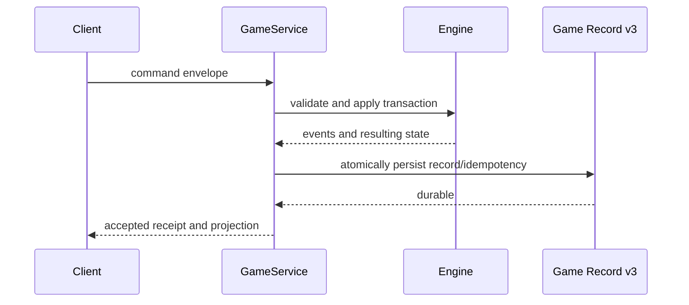

# Replay architecture

Game Record v3 is the durable command/evidence boundary. A manifest pins the
engine, profile, decks, card database, semantic registry, seed, trace policy,
CardProgram V2 fingerprints/trust closures, capability registry/evidence,
semantic-handler registry, runtime-component inventory, and lifecycle. Each
accepted command additionally pins the card programs and compact runtime
bindings actually used. Checkpoints accelerate recovery;
commands remain the authority for deterministic verification.

Replay rebuilds from the initial checkpoint and applies the canonical accepted
commands under matching fingerprints. It compares authoritative state hashes
and fails on version, semantics, CardProgram trust, runtime binding, database,
command, or result divergence. Historical v3 records without the additive
trust/runtime fields keep their existing semantic-registry verification.
Projected delivery packets are transport evidence, not alternative authority.

Capabilities are never persisted in raw form. Private record artifacts remain
ignored local data and must not be committed. See [Game Record v3](../../GAME_RECORD.md)
and the [replay testing guide](../testing/replay.md).
