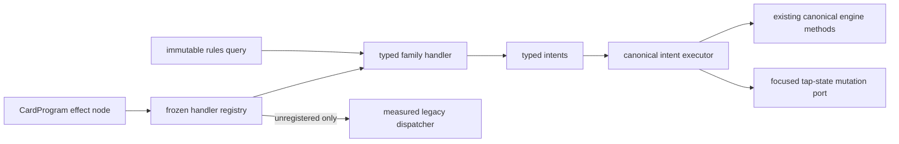

# Typed semantic handlers

The typed semantic runtime is an incremental boundary between CardProgram
effect nodes and authoritative mutation. Its frozen inventory currently owns
`draw`, `draw_each_player`, `become_monarch`, `tap`, `untap`, and
`untap_all_creatures`; every other operation remains on the explicit measured
legacy fallback and is not implied to be migrated.

Handlers receive only the acting seat, a default reason, the seats still
represented by the game, active seats, and APNAP order. They do not receive
hands, libraries, card objects, mutable state, projections, or record data.
The architecture validator rejects imports that would cross this boundary.

Each handler declares a stable ID, schema version, exact family, operation,
rule references, and bounded capability dependencies. Registration rejects
duplicate ownership and unknown capability IDs. Strict runtime binding records
the semantic-handler registry fingerprint and recomputes its capability
closure. Malformed input for a registered operation is a rules error;
it never falls back to permissive string dispatch.

The global registry aggregates family modules; it does not own family logic.
Draw and monarch lowering remains in `generic.py`. The permanent tap-state
schema and lowering live in `tap_state_handlers.py`, which prevents a
catch-all handler module from becoming another semantic monolith.

The executor is intentionally small. It sends `BecomeMonarchIntent` through
the existing canonical owner, but rejects every `DrawCardsIntent` unless the
caller first converts it into a replacement-aware draw-resolution request.
Turn entry, direct effect application, CardProgram stack resolution,
conditional semantic choices, optional follow-up effects, and APNAP batches
then converge on `mtg_commander_sim.drawing`. Its immutable model,
continuation, coordinator, and commit modules apply represented replacements
one draw at a time and preserve private choice and replay behavior without
giving the handler mutable state.

Tap-state intents use the focused `TapStateHost` port implemented by the
authoritative engine and committed in `mtg_commander_sim/tap_state.py`. A
single tap changes only an untapped battlefield permanent. Untap retains the
existing CR 122.1d stun-counter replacement path and logs an untap only when
the permanent actually untaps. The aggregate operation uses effective type
data, ignores phased-out permanents, and commits each eligible creature in
active-seat/battlefield order. Handlers themselves never inspect or mutate
state; only the classified rules-layer mutation owner does so.

The associated tap-state capabilities are intentionally `tested`, not
`trusted`. Complete tap/untap prohibitions, universal replacement participation, and
complete derived-characteristic interactions remain blockers. Registering an
operation does not upgrade a legacy-reviewed CardProgram to capability-closed.

The architecture audit scans every semantic-operation branch in the engine,
not only `apply_effect`. A registered operation intercepted before the handler
boundary is therefore reported as migration drift.

## Static runtime components

CardProgram's versioned `handlers` field is the fail-closed extension point for
abilities that participate in later events rather than resolve once. Runtime
descriptors are validated when semantic programs load, and registered handlers
receive only the narrow immutable event context required by their family.

`replacement.token.additional.v1` matches a declared token card type and same-
controller event, then contributes an immutable replacement effect. The
generic replacement-event tree provides affected-seat choice, rediscovery,
containing-before-contained ordering, and exact replay for competing
represented effects. `token_creation.py` owns final token commit and enter-
event dispatch. This removes printed-card-name dispatch for the reviewed
additional Thopter and Map replacements without claiming optional descriptors,
quantity doubling, or state-derived token definitions.

`replacement.zone.destination.v1` contributes a reviewed destination rewrite
plus typed nested counter events. It uses the object's controller on the battlefield
or stack and owner elsewhere, and simultaneous moves discover against one pre-
mutation snapshot. Dauthi Voidwalker is supplied by source-pinned semantic data
rather than an Oracle-ID engine branch. The parent zone event is exhausted
before its counter child, and all replacement choices occur before commit.

`replacement.counter.quantity.v1` contributes immutable fixed multiplication
or addition effects for represented effect-generated counters on battlefield
permanents. `counter_placement.py` owns the rollback-safe prepare/commit
transaction, affected-controller choice, and APNAP batch. Runtime components
never mutate counters. Remaining entry, cost, rule-action, player-counter, and
continuation-sensitive producers keep broad CR 122/614/616 blocked.

`continuous.anthem.power_toughness.v1` emits one source-stamped layer-7c
effect for a fixed same-controller subtype anthem. Active sources are collected
through a read-only state protocol; printed names never participate in runtime
selection. Applicability is evaluated after earlier layers, so a supported
layer-4 subtype change can enable the modifier. Multiple sources stack by
timestamp and stable component identity. This component excludes setting
power/toughness, characteristic-defining abilities, state-derived amounts,
same-layer dependency discovery, and ability-removal dependency interactions.

Complete historical semantic snapshots that predate these descriptors can use
the validated built-in component as a compatibility bridge. The loaded program
map and its recorded fingerprint remain unchanged, and source-hash validation
still gates execution. Current records pin the descriptor directly.

## Migration checklist

1. Characterize the current operation and exact return/event behavior.
2. Define a typed node and intent with the smallest read-only query surface.
3. Register one stable handler and bounded capability dependencies.
4. Add direct lowering, malformed-input rollback, ordinary stack-resolution,
   and exact replay tests.
5. Remove every corresponding engine dispatch branch, including any
   pre-resolution special case outside `apply_effect`.
6. Update CardProgram explain/audit mapping and generated architecture status.

Do not use this boundary to widen Oracle coverage or conceal unresolved cost,
target, replacement, prevention, visibility, or interaction semantics. See
[ADR 0006](../adr/0006-typed-semantic-handler-boundary.md),
[ADR 0009](../adr/0009-typed-tap-state-mutation-owner.md),
[ADR 0010](../adr/0010-replacement-event-tree-and-token-owner.md),
[ADR 0011](../adr/0011-counter-placement-event-and-mutation-owner.md), and the separate
[runtime-component architecture](runtime-components.md).
