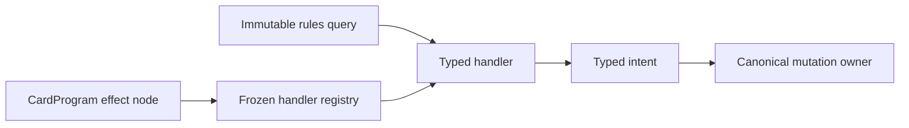

# Typed semantic handlers

Typed semantic handlers execute one immediate CardProgram instruction. They
translate a validated typed node and bounded immutable rules query into typed
intents. Canonical engine or focused mutation owners commit those intents.
Handlers never receive mutable `GameState`, private projections, persistence
objects, or unrestricted engine access.

Every registration declares a stable handler ID, schema version, exact
operation family, rule references, and bounded capability dependencies.
Duplicate ownership and unknown capabilities are rejected. Malformed input to
a registered operation is a rules error and cannot fall back to permissive
string dispatch. Strict preflight fingerprints the registry and recomputes its
capability closure.

Family modules own lowering; the aggregate registry owns only discovery and a
stable inventory. A handler may request a narrowly defined continuation for a
choice or replacement-aware transaction, but it may not retain mutable state
or commit around the canonical owner. Rollback must leave no partial mutation.

Behavior that participates in later events—replacements, prevention, static
effects, and other persistent descriptors—belongs to
[runtime components](runtime-components.md), not this boundary. Family-specific
mutation and ordering contracts belong in subsystem documents such as
[drawing](drawing.md), [damage](damage.md), [prevention](prevention.md), and
[counter placement](counter-placement.md). Direct permanent destruction and
return-to-owner-hand instructions lower through strict handlers into their
identity-pinned transactions; neither handler reparses Oracle text or owns the
underlying counter or zone mutation.

To migrate an instruction, characterize existing output and replay, define the
smallest typed node/query/intent surface, register one stable handler, add
success and malformed-input rollback tests, and remove every parallel dispatch
path. Registration does not itself raise the trust level of any CardProgram.

See [ADR 0006](../adr/0006-typed-semantic-handler-boundary.md),
[ADR 0009](../adr/0009-typed-tap-state-mutation-owner.md), and
[ADR 0014](../adr/0014-typed-semantic-choice-and-effect-ownership.md),
[ADR 0027](../adr/0027-typed-permanent-destruction.md), and
[ADR 0028](../adr/0028-typed-return-to-owner-hand.md).
