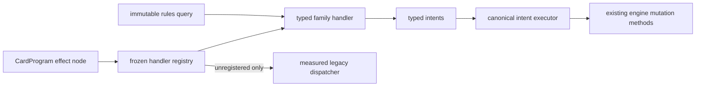

# Typed semantic handlers

The typed semantic runtime is an incremental boundary between CardProgram
effect nodes and authoritative mutation. It currently owns `draw`,
`draw_each_player`, and `become_monarch`; every other operation remains on the
explicit legacy fallback and is not implied to be migrated.

Handlers receive only the acting seat, a default reason, the seats still
represented by the game, active seats, and APNAP order. They do not receive
hands, libraries, card objects, mutable state, projections, or record data.
The architecture validator rejects imports that would cross this boundary.

Each handler declares a stable ID, schema version, one operation, and bounded
capability dependencies. Registration rejects duplicate ownership and unknown
capability IDs. Malformed input for a registered operation is a rules error;
it never falls back to permissive string dispatch.

The executor is intentionally small. Direct effect application sends
`DrawCardsIntent` and `BecomeMonarchIntent` through
`CommanderEngine.draw` and `CommanderEngine.become_monarch`. Ordinary
CardProgram stack resolution also lowers registered nodes through this same
handler registry. Draw intents then enter the engine's replacement-aware draw
sequence so represented draw replacements and private draw continuations keep
their existing behavior. Handlers themselves never mutate state.

The architecture audit scans every semantic-operation branch in the engine,
not only `apply_effect`. A registered operation intercepted before the handler
boundary is therefore reported as migration drift.

## Static runtime components

CardProgram's versioned `handlers` field is the fail-closed extension point for
abilities that participate in later events rather than resolve once. Runtime
descriptors are validated when semantic programs load, and registered handlers
receive only the narrow immutable event context required by their family.

`replacement.token.additional.v1` is the first such component. It matches a
declared token card type and same-controller event, then emits a typed fixed
additional-token intent. This removes printed-card-name dispatch for the
reviewed additional Thopter and Map replacements. It deliberately does not
claim optional or noncommutative CR 616 ordering, replacement rediscovery,
quantity doubling, or state-derived token definitions. See
[ADR 0007](../adr/0007-cardprogram-runtime-components.md).

`continuous.anthem.power_toughness.v1` emits one source-stamped layer-7c
effect for a fixed same-controller subtype anthem. Active sources are collected
through a read-only state protocol; printed names never participate in runtime
selection. Applicability is evaluated after earlier layers, so a supported
layer-4 subtype change can enable the modifier. Multiple sources stack by
timestamp and stable component identity. This component excludes setting
power/toughness, characteristic-defining abilities, state-derived amounts,
same-layer dependency discovery, and ability-removal dependency interactions.

Complete historical semantic snapshots that predate these descriptors can use
the validated built-in component as a compatibility bridge. The loaded program
map and its recorded fingerprint remain unchanged, and source-hash validation
still gates execution. Current records pin the descriptor directly.

## Migration checklist

1. Characterize the current operation and exact return/event behavior.
2. Define a typed node and intent with the smallest read-only query surface.
3. Register one stable handler and bounded capability dependencies.
4. Add direct lowering, malformed-input rollback, ordinary stack-resolution,
   and exact replay tests.
5. Remove every corresponding engine dispatch branch, including any
   pre-resolution special case outside `apply_effect`.
6. Update CardProgram explain/audit mapping and generated architecture status.

Do not use this boundary to widen Oracle coverage or conceal unresolved cost,
target, replacement, prevention, visibility, or interaction semantics. See
[ADR 0006](../adr/0006-typed-semantic-handler-boundary.md).
